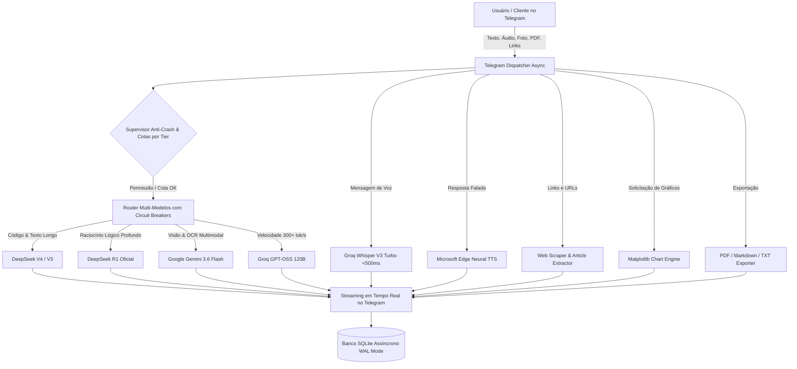

# 🧠 BrainBot — Enterprise Multi-Model AI Assistant & SaaS Platform (v3.0)

> **Assistente Corporativo e Plataforma SaaS de Inteligência Artificial para Telegram**, desenvolvido em Python 3.12 com arquitetura assíncrona de alta disponibilidade, roteamento multi-modelos (*Top 4 Elite Engines*), gerenciamento ultrarrápido com **Astral `uv` (Rust)**, síntese de voz neural (Text-to-Speech), leitor automático de links, análise de dados e plotagem de gráficos com Matplotlib, exportação de conversas em PDF, sistema de onboarding e autorização de clientes com 1 clique, supervisão *anti-crash*, servidor de telemetria HTTP (`/health`) e **Painel Administrativo Master**.

---

## 📑 Índice

- [Arquitetura & Fluxo do Sistema](#-arquitetura--fluxo-do-sistema)
- [Top 4 Motores de IA Integrados](#-top-4-motores-de-ia-integrados)
- [Os 6 Superpoderes Enterprise](#-os-6-superpoderes-enterprise)
- [Sistema de Clientes e SaaS (Onboarding com 1 Clique)](#-sistema-de-clientes-e-saas-onboarding-com-1-clique)
- [Painel Administrativo Master (`/admin`)](#-painel-administrativo-master-admin)
- [Deploy Automatizado Zero-Touch](#-deploy-automatizado-zero-touch)
- [Comandos Operacionais (Makefile & Docker)](#-comandos-operacionais-makefile--docker)
- [Variáveis de Ambiente (`.env`)](#-variáveis-de-ambiente-env)
- [Tabela Completa de Comandos](#-tabela-completa-de-comandos)
- [Estrutura do Projeto](#-estrutura-do-projeto)
- [Publicação no GitHub](#-publicação-no-github)

---

## 🧠 Arquitetura & Fluxo do Sistema



---

## 🏆 Top 4 Motores de IA Integrados

| Motor / Modelo | Provedor | Destaque Técnico | Status |
| :--- | :--- | :--- | :---: |
| **⚡ DeepSeek V4 / V3** | DeepSeek API | Flagship global para programação sênior e lógica. | 🟢 **ATIVO** |
| **🧠 DeepSeek R1** | DeepSeek API | Raciocínio matemático formal com encadeamento de pensamentos. | 🟢 **ATIVO** |
| **⚡ Gemini 3.6 Flash** | Google AI | Visão Computacional, OCR e contexto de 1 milhão de tokens. | 🟢 **ATIVO** |
| **🚀 GPT-OSS 120B (Groq)** | Groq Cloud | Modelo de 120B parâmetros rodando a 300+ tokens/segundo em LPUs. | 🟢 **ATIVO** |
| **🎙️ Whisper Large V3 Turbo** | Groq Cloud | Transcrição de áudios de voz instantânea (< 500ms). | 🟢 **ATIVO** |
| **🟢 GPT-4o Oficial** | GitHub Models | Modelo oficial da OpenAI via Microsoft Azure. | 🟢 **CONFIGURADO** |

---

## 🚀 Os 6 Superpoderes Enterprise

1. **🎙️ Respostas Faladas em Áudio (Text-to-Speech):** Voz neural humana em português brasileiro. Ativado via `/voz` ou automaticamente quando o usuário envia um áudio de voz.
2. **🔗 Leitor e Analisador de Links / URLs:** Basta colar qualquer link no chat para o bot extrair o texto limpo e analisar a página.
3. **🧠 Memória Permanente de Longo Prazo:** O bot grava preferências com `/lembrar <fato>` e utiliza em todas as conversas futuras.
4. **📑 Exportação de Conversas:** Baixe relatórios completos em PDF formatado, Markdown ou TXT com `/exportar`.
5. **🎭 Especialistas Profissionais (GPTs com 1 Toque):** Modos Dev Sênior, Analista Financeiro, Copywriter, Auditor Jurídico e Professor de Inglês.
6. **📊 Visualização de Dados e Gráficos:** Peça um gráfico de pizza ou barras e receba a imagem PNG renderizada em alta definição.

---

## 💼 Sistema de Clientes e SaaS (Onboarding com 1 Clique)

O BrainBot foi arquitetado para permitir que você venda acesso a clientes:

* **Cartão de Onboarding:** Usuários não autorizados recebem um cartão elegante com seu contato e botão `[ Solicitar Acesso Instantâneo ]`.
* **Notificação Instantânea para o Admin:** Você recebe uma notificação no Telegram com botões:
  * `[ 🟢 Aprovar Free (30 msgs/dia) ]`
  * `[ 💎 Aprovar Pro (200 msgs/dia) ]`
  * `[ 👑 Aprovar VIP Ilimitado ]`
  * `[ ❌ Recusar Solicitação ]`
* **Liberação Automática:** Ao clicar, o cliente é ativado no SQLite e recebe mensagem de boas-vindas na hora.

---

## 🎛️ Painel Administrativo Master (`/admin`)

* 👥 **Gestão de Clientes:** Listagem de usuários, controle de planos (`/promover`) e bloqueio (`/ban` / `/unban`).
* 📢 **Copywriting de Vendas:** Gerador da mensagem comercial pronta comparando os preços individuais de mercado (ChatGPT Plus R$ 99,90, Grok R$ 149,90, Gemini Pro R$ 96,99) contra os R$ 30,00/mês do seu bot (`/marketing`).
* 📣 **Transmissão Global (`/broadcast <texto>`):** Dispara comunicados para todos os clientes.
* 💾 **Backup do SQLite:** Envia o arquivo de banco de dados atualizado direto no Telegram.
* 🔒 **Alternador de Acesso:** Alterna entre `WHITELIST`, `PRIVATE` e `PUBLIC` em tempo real.

---

## 🐳 Deploy Automatizado Zero-Touch

```bash
# 1. Clonar o repositório
git clone https://github.com/SEU_USUARIO/brain-bot.git
cd brain-bot

# 2. Configurar o .env
cp .env.example .env
nano .env

# 3. Executar o deploy automatizado
bash deploy.sh
```

---

## 🎮 Comandos Operacionais (Makefile & Docker)

| Ação | Comando Makefile | Comando Docker Direto |
| :--- | :--- | :--- |
| **Iniciar em 24/7** | `make up` | `docker compose up -d` |
| **Ver Logs ao Vivo** | `make logs` | `docker compose logs -f` |
| **Status e Saúde** | `docker compose ps` | `docker compose ps` |
| **Reiniciar o Bot** | `make restart` | `docker compose restart` |
| **Parar o Bot** | `make down` | `docker compose down` |
| **Checagem de Saúde** | `make health` | `curl -s http://localhost:8080/health` |

---

## 📱 Tabela Completa de Comandos

| Comando | Nível | Descrição |
| :--- | :---: | :--- |
| `/menu` | Todos | Abre o Menu Principal Interativo |
| `/limpar` | Todos | Inicia um Novo Chat limpo (*Zerar Memória*) |
| `/assistentes`| Todos | Escolhe personas profissionais (Dev, Finanças, Copywriter, etc) |
| `/voz` | Todos | Liga/desliga o modo de respostas faladas em áudio |
| `/lembrar` | Todos | Grava uma memória permanente sobre o usuário |
| `/memorias` | Todos | Lista e gerencia memórias salvas |
| `/exportar` | Todos | Baixa o histórico da conversa em PDF, MD ou TXT |
| `/web <busca>`| Todos | Pesquisa na internet com síntese em tempo real |
| `/imagem <prompt>`| Todos | Gera ilustrações em alta definição (Flux.1) |
| `/status` | Todos | Exibe status da conta do cliente ou telemetria do admin |
| `/modelos` | Admin | Alterne entre os motores DeepSeek, Gemini, Groq e GPT-4o |
| `/admin` | Admin | Painel Master Admin com controle total |
| `/marketing` | Admin | Exibe a mensagem de vendas formatada pronta para envio |
| `/broadcast` | Admin | Transmite comunicado para todos os clientes ativos |
| `/promover` | Admin | Promove cliente para `free`, `pro` ou `unlimited` |
| `/ban` / `/unban`| Admin | Bloqueia ou desbloqueia um cliente |

---

## 🌐 Publicação no GitHub

Para publicar seu projeto no GitHub com total segurança:

```bash
# 1. Adicionar o remote do seu repositório no GitHub
git remote add origin https://github.com/SEU_USUARIO/brain-bot.git

# 2. Enviar a branch principal
git branch -M main
git push -u origin main
```

*(O arquivo `.gitignore` já está configurado para proteger seu `.env` e seu banco de dados `data/*.sqlite` contra qualquer vazamento).*
