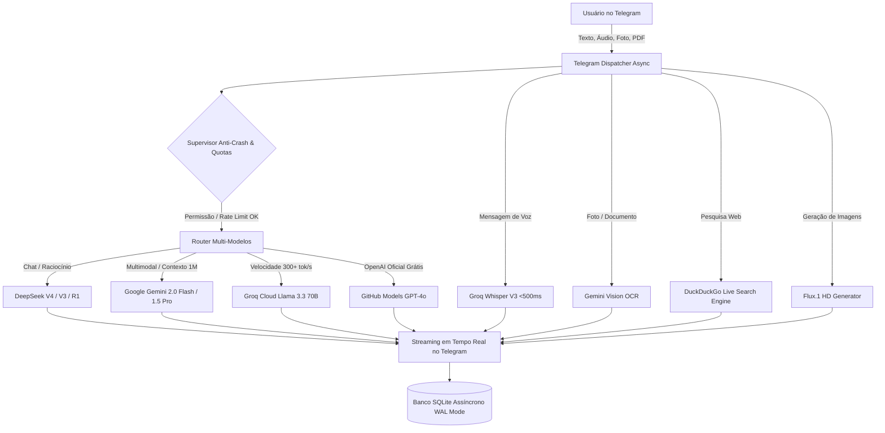

# 🧠 BrainBot — Enterprise Multi-Model AI Assistant (v2.0)

> **Assistente Institucional de Inteligência Artificial para Telegram**, desenvolvido em Python 3.12 com arquitetura assíncrona de alta disponibilidade, roteamento multi-modelos (*Top 4 Elite Engines*), gerenciamento ultrarrápido com **Astral `uv` (Rust)**, supervisão *anti-crash* com *circuit breakers*, servidor de telemetria HTTP (`/health`) e **Painel de Controle Administrativo Master** diretamente pelo Telegram.

---

## 📑 Índice

- [Arquitetura & Fluxo do Sistema](#-arquitetura--fluxo-do-sistema)
- [Top 4 Motores de IA Integrados](#-top-4-motores-de-ia-integrados)
- [Funcionalidades e Recursos](#-funcionalidades-e-recursos)
- [Deploy Automatizado Zero-Touch (Linux / VPS / Raspberry Pi)](#-deploy-automatizado-zero-touch-linux--vps--raspberry-pi)
- [Comandos Operacionais (Makefile & Docker)](#-comandos-operacionais-makefile--docker)
- [Painel Administrativo Master (`/admin`)](#-painel-administrativo-master-admin)
- [Registro e Memória de Conversas (Estilo ChatGPT)](#-registro-e-memória-de-conversas-estilo-chatgpt)
- [Variáveis de Ambiente (`.env`)](#-variáveis-de-ambiente-env)
- [Comandos do Telegram](#-comandos-do-telegram)
- [Estrutura do Projeto](#-estrutura-do-projeto)
- [Publicação no GitHub](#-publicação-no-github)

---

## 🧠 Arquitetura & Fluxo do Sistema



---

## 🏆 Top 4 Motores de IA Integrados

O BrainBot foi arquitetado para focar estritamente nos 4 melhores motores do mundo, combinando seu plano **DeepSeek V4 Pro** com cotas gratuitas oficiais:

| Motor / Modelo | Provedor | Categoria | Destaque Técnico |
| :--- | :--- | :---: | :--- |
| **💡 DeepSeek V4 / V3 / R1** | DeepSeek API | Flagship | Raciocínio formal passo a passo e excelência em programação. |
| **⚡ Gemini 2.0 Flash / 1.5 Pro** | Google AI Studio | 100% Grátis | Contexto massivo (1M+ tokens), visão computacional e OCR de PDFs. |
| **🚀 Llama 3.3 70B & Whisper V3** | Groq Cloud | 100% Grátis | Velocidade extrema (300+ tok/s) em hardware LPU e áudios instantâneos. |
| **🟢 GPT-4o & GPT-4o Mini** | GitHub Models (Azure) | 100% Grátis | O modelo oficial original da OpenAI hospedado na nuvem Azure. |

---

## 🚀 Funcionalidades e Recursos

* ⚡ **Streaming em Tempo Real:** Respostas exibidas com digitação ao vivo sem travar a interface.
* 🛡️ **Circuit Breakers & Auto-Healing:** Se uma API oscilar, o tráfego é desviado automaticamente para o próximo motor saudável.
* 🎙️ **Transcrição de Voz Ultrarrápida:** Envie áudios pelo Telegram e receba a resposta transcrita e contextualizada em segundos.
* 📄 **Análise de Arquivos:** Envie PDFs, códigos-fonte, TXT ou CSV para resumos e extração de dados.
* 🌐 **Pesquisa Web ao Vivo:** Comando `/web <busca>` pesquisa a internet via DuckDuckGo com síntese automática.
* 🎨 **Geração de Imagens HD:** Renderização via `/imagem <prompt>` com modelo Flux.1.
* 🩺 **Health Check HTTP na Porta 8080:** Endpoint REST `/health` integrado com Docker e monitoramento externo.

---

## 🐳 Deploy Automatizado Zero-Touch (Linux / VPS / Raspberry Pi)

O BrainBot possui um script de deploy com instalação automática de dependências:

```bash
# 1. Clonar repositório
git clone https://github.com/SEU_USUARIO/brain-bot.git
cd brain-bot

# 2. Configurar chaves no .env
cp .env.example .env
nano .env

# 3. Executar o deploy automatizado
bash deploy.sh
```

---

## 🎮 Comandos Operacionais (Makefile & Docker)

| Ação | Comando Makefile | Comando Docker Direto |
| :--- | :--- | :--- |
| **Iniciar em 24/7** | `make up` | `docker compose up -d` |
| **Ver Logs ao Vivo** | `make logs` | `docker compose logs -f` |
| **Status e Saúde** | `docker compose ps` | `docker compose ps` |
| **Reiniciar o Bot** | `make restart` | `docker compose restart` |
| **Parar o Bot** | `make down` | `docker compose down` |
| **Checagem de Saúde** | `make health` | `curl -s http://localhost:8080/health` |

---

## 🎛️ Painel Administrativo Master (`/admin`)

Acesso restrito exclusivamente ao `ADMIN_USER_ID`:

```
┌────────────────────────────────────────────────────────┐
│ 🎛️ PAINEL DE CONTROLE INSTITUCIONAL (MASTER ADMIN)      │
│                                                        │
│ [ 📊 Telemetria do Servidor ]  [ 📈 Métricas de Negócio]│
│ [ 👥 Top Usuários & Cotas   ]  [ 🔒 Alternar Modo Acesso]│
│ [ 💾 Fazer Backup do Banco  ]  [ 🔄 Recarregar Configs ]│
└────────────────────────────────────────────────────────┘
```

* **Telemetria de Hardware:** Monitora CPU (%), RAM (MB e %), Espaço em Disco, Tamanho do SQLite e Uptime.
* **Métricas de Negócio (SaaS):** Contagem de usuários ativos, mensagens diárias e consumo de ferramentas.
* **Backup Sob Demanda:** Envia o arquivo `.sqlite` atualizado como documento diretamente no seu Telegram.
* **Transmissão em Massa:** Comando `/broadcast <mensagem>` dispara avisos para toda a base de usuários.

---

## 💬 Registro e Memória de Conversas (Estilo ChatGPT)

O BrainBot opera com gerenciamento de sessões e histórico completo:

1. **Histórico na Nuvem do Telegram:** Todas as conversas ficam salvas na interface do Telegram, com busca por texto, fotos e áudios em qualquer dispositivo (Celular, Tablet, Web e Desktop).
2. **Memória de Contexto Ativa:** O bot utiliza uma janela deslizante configurável (`MAX_CONTEXT_TURNS=20`) para lembrar dos tópicos anteriores da conversa.
3. **Persistência no Banco de Dados:** Todas as mensagens são gravadas com timestamp no SQLite na tabela `messages`.
4. **Novo Chat (`/limpar`):** Reinicia o contexto de conversa a qualquer momento, permitindo iniciar um novo assunto do zero exatamente como o botão *New Chat* do ChatGPT.

---

## ⚙️ Variáveis de Ambiente (`.env`)

```ini
# --- TELEGRAM ---
TELEGRAM_BOT_TOKEN="8974954089:AAEjrQg3RQuljvBlFZ6_OaWNDDEnNE57ZJE"
ADMIN_USER_ID=151555721
ACCESS_MODE=PRIVATE  # PRIVATE | WHITELIST | PUBLIC

# --- CHAVES DE IA ---
DEEPSEEK_API_KEY="sk-..."
GEMINI_API_KEY="AIzaSy..."
GROQ_API_KEY="gsk_..."
GITHUB_TOKEN="ghp_..."

# --- SISTEMA ---
DEFAULT_MODEL=deepseek
DATABASE_PATH=data/brain_bot.sqlite
MAX_CONTEXT_TURNS=20
STREAMING_THROTTLE_SECONDS=1.2
HEALTH_PORT=8080
LOG_LEVEL=INFO
```

---

## 📱 Comandos do Telegram

| Comando | Descrição |
| :--- | :--- |
| `/start` | Menu inicial e boas-vindas |
| `/modelos` | Menu com botões para troca instantânea de modelo |
| `/limpar` | Reinicia a memória da conversa (*Novo Chat*) |
| `/status` | Exibe o modelo ativo, cota e dados da sessão |
| `/web <busca>` | Pesquisa na internet em tempo real |
| `/imagem <prompt>` | Gera imagens em alta definição via Flux.1 |
| `/prompt <texto>` | Personaliza a persona/instrução do sistema para o usuário |
| `/admin` | Abre o Painel de Controle Master (Apenas Administrador) |
| `/broadcast <msg>` | Envia comunicado para todos os usuários (Admin) |
| `/promover <ID> <tier>` | Altera plano do usuário: `free`, `pro` ou `unlimited` |
| `/ban <ID>` / `/unban <ID>` | Bloqueia ou reativa acesso de um usuário |

---

## 📂 Estrutura do Projeto

```
brain-bot/
├── .env                    # Variáveis de ambiente e chaves locais
├── .env.example            # Template de configuração
├── .gitignore              # Proteção de credenciais e bancos
├── pyproject.toml          # Gerenciamento de dependências com UV (PEP 621)
├── Dockerfile              # Imagem de produção ultrarrápida com Astral UV
├── docker-compose.yml      # Orquestração do contêiner e volume /data
├── Makefile                # Automação de ciclo de vida
├── deploy.sh               # Script de deploy automatizado zero-touch
├── README.md               # Documentação técnica completa
├── data/                   # Volume persistente do banco SQLite (WAL Mode)
└── app/
    ├── config.py           # Validador de configurações
    ├── main.py             # Entrypoint com supervisor anticrash
    ├── database/
    │   └── db.py           # SQLite Assíncrono (users, messages, metrics, settings)
    ├── core/
    │   ├── router.py       # Roteador Top 4 Elite com Fallback automático
    │   ├── resilience.py   # Circuit Breakers e Telemetria de Sistema
    │   ├── health.py       # Servidor HTTP /health na porta 8080
    │   ├── vision.py       # Visão via Gemini Flash (100% grátis)
    │   ├── audio.py        # Transcrição instantânea com Groq Whisper
    │   ├── web_search.py   # Busca ao vivo via DuckDuckGo
    │   ├── documents.py    # Leitor de PDFs e código-fonte
    │   └── image_gen.py    # Geração de imagens HD com Flux.1
    └── handlers/
        ├── admin.py        # Painel Master, Telemetria e Broadcast
        ├── commands.py     # Comandos de usuário (/start, /modelos, /status)
        ├── callbacks.py    # Botões inline interativos
        ├── messages.py     # Streaming de texto em tempo real
        └── media.py        # Fotos, Áudios de voz e Documentos
```

---

## 🌐 Publicação no GitHub

```bash
git add .
git commit -m "docs: complete institutional documentation and session management guide"
git remote add origin https://github.com/SEU_USUARIO/brain-bot.git
git push -u origin main
```
